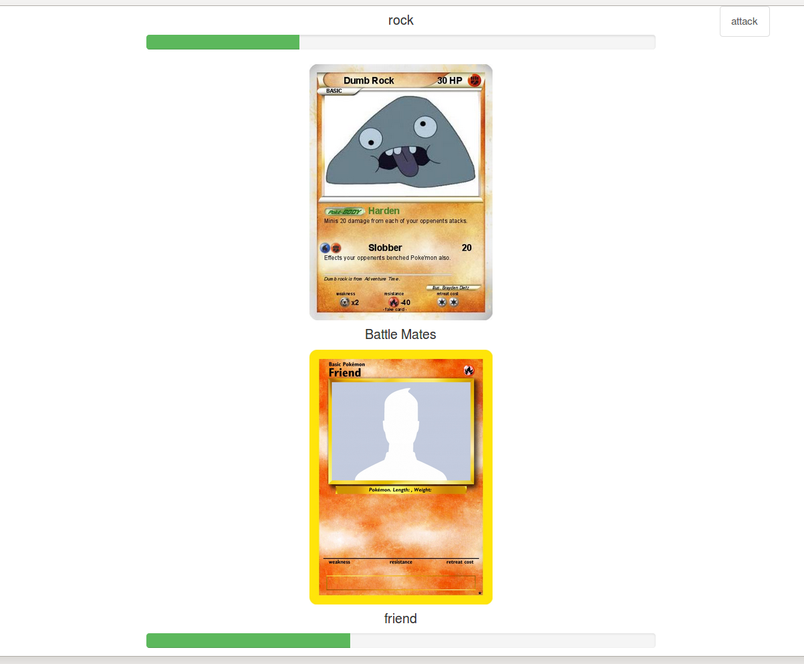
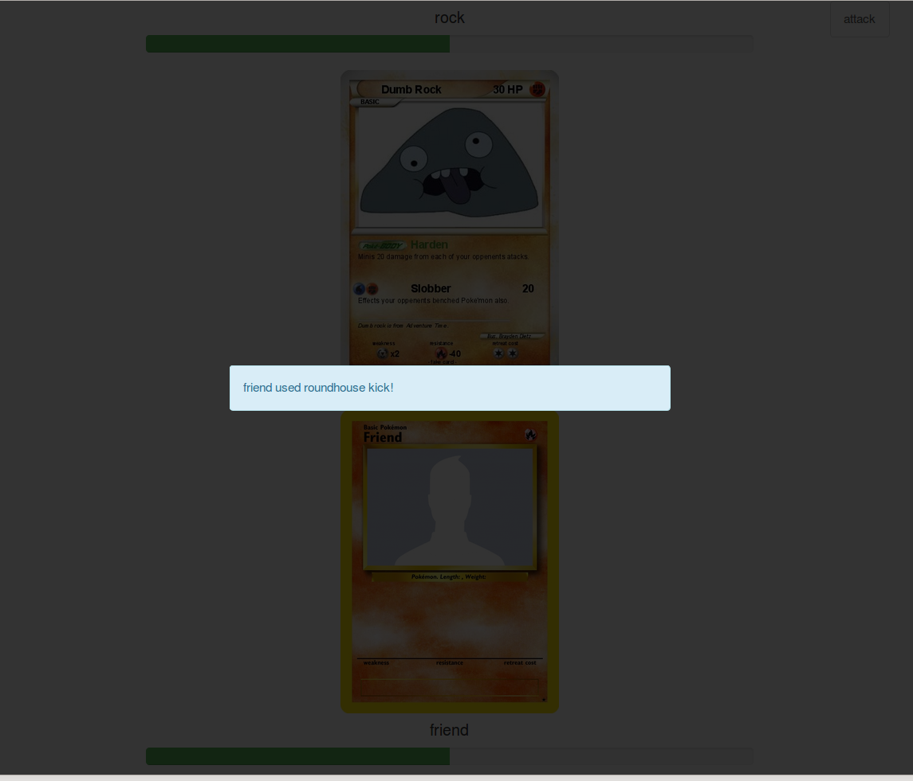
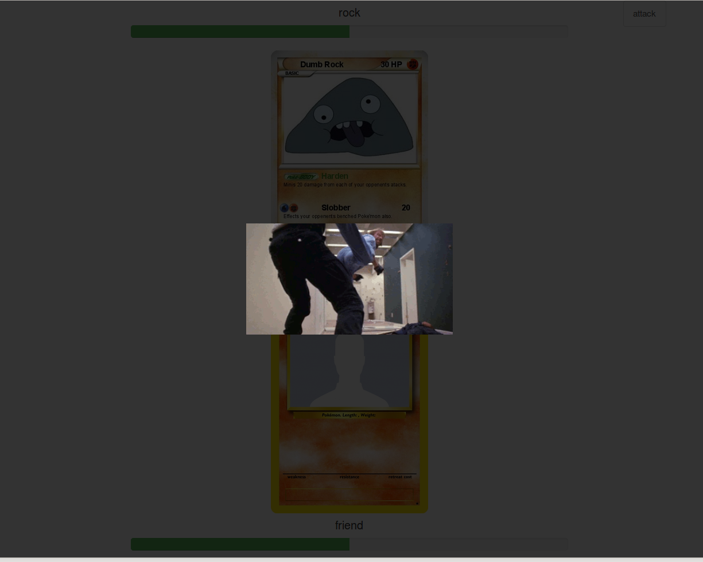

# battlemates
Turn based pokemon-style battle using your friends.

## overview
Battlemates is an HTML5 game that uses Ember.js on the client
side and node.js/express on the server side. I was recently exposed
to the socket library, ZMQ, at work so I've become interested in 
working with sockets. I was led to socket.io and decided I really
wanted to work on a project using this. Naturally, I decided to do 
something silly and decided I wanted to create a Pokemon-style
game where your friends would be the 'pokemon'.

## plans
Since CS students at my school aren't required to have a senior project,
I've decided I will make this my personal senior project. I plan to 
blow this game out of proportion and just try to apply as much as I have
learned since I began my journey as a programmer. I should have a blog
about this project up and running pretty soon

## notes
*7/31/2015*: THE CODE IS DISGUSTING. Things are broken. Everything is
hard to read. The folder structure is bad. I have never worked on any
web app that is not RESTful so I there is a lot wrong right now. In
retrospect, I probably should've done a little more reading as opposed
to just diving in, but I was really excited to get my project started. There is some major refactoring to be done before I can continue. 

##images

